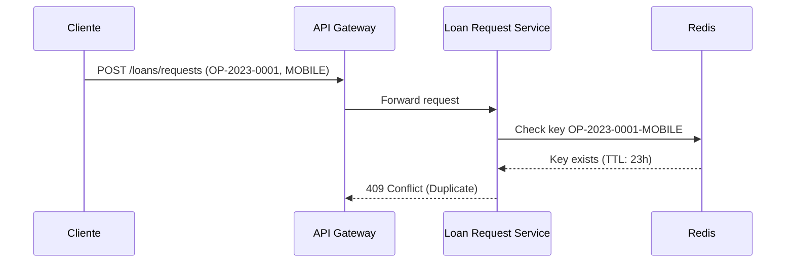

# Prompt para Mejorar el Codigo Base

Copia y pega el contenido del bloque de abajo en un asistente de IA (Claude, ChatGPT)
para obtener un ZIP con el proyecto completo y arrancable.

Si preferis trabajar en tu editor con un agente local (Claude Code, Cursor, Copilot), usa `AGENTS.md` en vez de este archivo: dice lo mismo pero para que escriba los archivos en disco.

## Las dos reglas que no se negocian

1. **Completa el boilerplate.** Todo lo que el proyecto necesita para compilar y arrancar: manifiesto de dependencias, punto de entrada, configuracion, capa de interfaz, y las capas del patron arquitectonico declarado. Eso es andamiaje y es tu trabajo.
2. **NO resuelvas el reto.** Los entregables de las fases son el trabajo de la persona. El hueco pedagogico se deja como esta: el proyecto arranca, pero lo que el reto pide implementar NO esta implementado.

Dicho de otra forma: si algo impide compilar, arreglalo. Si algo es logica de negocio incompleta, validaciones ausentes, un secreto hardcodeado o un patron mejorable, dejalo exactamente como esta — es lo que la persona tiene que encontrar.

## Superficie de practica — NO resuelvas

Estos archivos SON el ejercicio de la persona. No los implementes; deja stubs.

- `adr/001-idempotencia-solicitudes.md` — El topic pide decisiones de arquitectura: el ADR es el ejercicio.
- `adr/002-manejo-latencia-buro.md` — El topic pide decisiones de arquitectura: el ADR es el ejercicio.
- `adr/003-throughput-sla.md` — El topic pide decisiones de arquitectura: el ADR es el ejercicio.

## Como saber que terminaste

```bash
python3 -c "import glob,sys; assert glob.glob('adr/*.md') and glob.glob('diagramas/*.mmd'), 'faltan ADRs o diagramas'"
```

Ese comando corriendo sin errores es la definicion de "listo".

---

```
## Briefing del reto (autoridad)
Este bloque manda sobre los archivos adjuntos. El stack y el rol salen de AQUÍ, no de un topic genérico ni de markdown placeholder.

### Perfil
Chapter Arquitectura, Especialidad Soluciones, Senior

### Brecha de conocimiento
Sostiene las decisiones de arquitectura con atributos de calidad medibles y trade-offs explicitos

### Misión / candidato
Candidato con 8 años de experiencia

### Reto
- Tema: Diseno de solucion extremo a extremo 1790190135969
- Seniority: senior-l2
- Tipo: mixed
- Título: Diseño de solución extremo a extremo para sistema de préstamos
- Tiempo estimado: 40 horas

### Fases (trabajo del HUMANO — PROHIBIDO completarlas)
No implementes estos entregables. Dejalos como hueco pedagógico. El asistente solo materializa el proyecto arrancable para que el participante pueda trabajar.
- Fase 1: Especificación del dominio y requisitos — objetivo: Definir claramente los actores, fuentes, sumideros y reglas de negocio para el sistema de préstamos. — entregable (NO resolver): Documento de especificación del dominio y requisitos del sistema de préstamos.
- Fase 2: Evaluación de decisiones de arquitectura — objetivo: Evaluar y seleccionar decisiones de arquitectura que cumplan con los atributos de calidad medibles y explicitar los trade-offs. — entregable (NO resolver): Documento de evaluación de decisiones de arquitectura con trade-offs explicitos.
- Fase 3: Comunicación de decisiones a audiencias distintas — objetivo: Comunicar las decisiones de arquitectura a audiencias técnicas y de negocio de manera efectiva. — entregable (NO resolver): Presentación y informe de decisiones de arquitectura para audiencias técnicas y de negocio.
- Fase 4: Implementación y verificación de la solución — objetivo: Implementar y verificar que la solución cumple con los requisitos y decisiones de arquitectura seleccionadas. — entregable (NO resolver): Solución implementada y verificada con documentación de desviaciones o ajustes.

Eres un asistente experto en análisis, corrección y generación de archivos de cualquier tipo:
código fuente, documentación, hojas de cálculo, documentos Word, configuraciones, entre otros.
Voy a enviarte una cadena de texto que contiene uno o más archivos. Cada archivo está delimitado por un marcador con el siguiente formato:
// === ARCHIVO: ruta/del/archivo.extension ===
o también puede aparecer como:
## === ARCHIVO: ruta/del/archivo.extension ===
Lo que sigue al marcador puede ser:

El contenido real del archivo (código, texto, YAML, etc.)
Una descripción en lenguaje natural de lo que debe contener el archivo


TU TAREA
PASO 0 — ¿Esto es un proyecto o una carcasa?
Antes de extraer archivos, leé el Briefing (si está) y diagnosticá el adjunto.

Es CARCASA si ocurre CUALQUIERA de estas:
- No hay manifiesto de dependencias del stack del briefing (manifest.json de VTEX IO / package.json / pom.xml / build.gradle / requirements.txt / go.mod / *.tf / *.csproj, según corresponda)
- Hay un "binario" que en realidad es un comentario ("no puede ser mostrado como texto plano", placeholder .fig/.docx vacío)
- Los markdowns ya completan entregables de fases posteriores ("se implementó fade-in", lista de áreas ya resuelta)

Si es CARCASA:
- MATERIALIZÁ un proyecto que arranca en el stack del briefing (VTEX IO Store Framework, Angular, Terraform, pytest, Nest, etc.). Incluí manifiesto, punto de entrada y capa de interfaz reales.
- NO copies los markdowns de "solución" como si fueran el producto. Son ruido de generación.
- NO resuelvas las fases del briefing (están marcadas PROHIBIDO). Dejá el hueco pedagógico: el flujo existe, las microinteracciones/calidad/infra que el reto pide NO están hechas.
- Después seguí al PASO 5 (ZIP).

Si es un proyecto REAL (manifiesto + código que compila o arranca):
- Seguí PASO 1 en adelante. 🔴 compilación sí. 🟡 pedagógico no.

PASO 1 — Detección y extracción
Identifica todos los archivos presentes en la cadena. Para cada archivo extrae:

Su ruta completa (ej: src/main/java/com/pragma/Service.java)
Su contenido o descripción

PASO 2 — Clasificación por tipo
Clasifica cada archivo en una de estas categorías:
A) Código fuente (Java, Python, TypeScript, JavaScript, Kotlin, etc.)
B) Configuración / documentación (YAML, properties, Markdown, JSON, txt, etc.)
C) Excel (.xlsx, .xls, .csv)
D) Word (.docx, .doc)
E) Otro tipo de archivo binario o especial
PASO 3 — Clasificación de errores en código fuente

Objetivo prioritario: que el proyecto compile. No corrijas flujo de negocio ni lógica funcional.

Antes de modificar cualquier archivo de código fuente, clasifica cada problema encontrado en una de estas dos categorías:
🔴 ERROR DE COMPILACIÓN — corregir siempre
Son errores que impiden que el proyecto arranque, sin valor pedagógico:

Import faltante o incorrecto
Clase, método o variable referenciada que no existe en ningún archivo del proyecto
Error de sintaxis
Anotación con atributos inválidos
Dependencia ausente en pom.xml, package.json, etc.
Archivo referenciado que no existe y debe ser creado con implementación mínima

→ CORREGIR estos errores.
🟡 PROBLEMA FUNCIONAL O DE CALIDAD — preservar siempre
Son problemas que no impiden compilar. Pueden ser intencionales para el aprendizaje:

Clave secreta hardcodeada ("secret", "password123")
API deprecada que funciona pero tiene reemplazo moderno
Lógica de negocio incorrecta o incompleta
Código redundante o de baja legibilidad
Falta de validaciones en flujo de negocio
Patrones de diseño incorrectos pero funcionales
Concurrencia no segura
Configuración funcional pero no óptima

→ PRESERVAR tal cual. No corregir, no mejorar, no comentar.
PASO 4 — Procesamiento según tipo de archivo
Tipo A — Código fuente
Aplica únicamente las correcciones clasificadas como 🔴 ERROR DE COMPILACIÓN.
No alteres ningún elemento clasificado como 🟡 PROBLEMA FUNCIONAL O DE CALIDAD.
Si falta un archivo referenciado, créalo con la implementación mínima necesaria para compilar.
Tipo B — Configuración / documentación
Extrae el contenido tal cual, sin modificaciones salvo errores evidentes de sintaxis
(ej: YAML mal indentado).
Tipo C — Excel (.xlsx)
Si viene con contenido real, genera el archivo respetando ese contenido.
Si viene con descripción en lenguaje natural, genera un archivo Excel funcional con:

Fila de encabezados en negrita con color de fondo distintivo
Columnas con ancho ajustado al contenido
Tipos de dato correctos por columna
Validaciones si la descripción lo indica
Hojas nombradas descriptivamente si hay más de una
Filas de ejemplo si no hay datos reales

Tipo D — Word (.docx)
Si viene con contenido real, genera el archivo respetando ese contenido.
Si viene con descripción en lenguaje natural, genera un documento Word funcional con:

Estilos de título (Título 1, Título 2) para jerarquía de secciones
Fuente legible (Calibri o equivalente), tamaño 11-12pt para cuerpo
Márgenes estándar
Tabla de contenido si tiene múltiples secciones
Tablas con encabezados en negrita si aplica

Tipo E — Otro
Genera el archivo con el contenido o estructura más apropiada según la descripción.
PASO 5 — Exportación en ZIP
Empaqueta todos los archivos en un único archivo ZIP descargable respetando exactamente
la estructura de rutas indicada por los marcadores.
El ZIP debe incluir:

Archivos de código con únicamente los errores de compilación corregidos
Archivos de configuración y documentación sin cambios
Archivos nuevos creados para resolver dependencias de compilación faltantes
Archivos Excel y Word generados desde descripción

IMPORTANTE: El ZIP debe estar listo para descargar al finalizar. No preguntes si el usuario
quiere generarlo. Simplemente genera el archivo y proporciona el enlace de descarga; No debes desplegar en el chat el resumen de lo que arreglaste al Zip, solo entregalo.

REGLAS IMPORTANTES

No omitas ningún archivo aunque no tenga errores ni modificaciones
Respeta los nombres y rutas exactas indicadas por los marcadores
Si un archivo no tiene marcador claro, infiere el nombre desde su contenido
Si la cadena contiene solo documentación, placeholders o binarios fake, NO la reproduzcas:
aplicá PASO 0 (materializar el proyecto del briefing). Reproducir la carcasa es un fallo.
No agregues texto después del enlace de descarga del ZIP
No preguntes si el usuario quiere el ZIP: simplemente generalo siempre
Si detectas que falta un archivo de configuración necesario para compilar
(pom.xml, package.json, requirements.txt, build.gradle, etc.), créalo e inclúyelo
inferiendo su contenido desde los imports y frameworks detectados en el código
Nunca corrijas problemas 🟡 aunque parezcan obvios o fáciles de mejorar.
El participante que recibirá este proyecto los debe encontrar y resolver él mismo.


INPUT
Aquí está la cadena con los archivos:

// === ARCHIVO: adr/001-idempotencia-solicitudes.md ===
# ADR 001: Idempotencia en Solicitudes de Préstamo

## Contexto
El sistema de préstamos debe garantizar que cada solicitud de préstamo sea procesada exactamente una vez, incluso si se reciben múltiples reintentos debido a fallos en la red o en el cliente. Esto es crítico para evitar duplicados en desembolsos y registros contables. Las solicitudes se identifican por un número de operación único por canal (web, móvil, sucursal) y deben ser idempotentes durante un periodo de 24 horas.

## Opciones Evaluadas

### Opción 1: Idempotencia basada en clave compuesta (número de operación + canal)
- **Descripción**: Usar una clave única compuesta por el número de operación y el canal para garantizar idempotencia.
- **Ventajas**: Simple de implementar, bajo overhead en almacenamiento.
- **Desventajas**: Requiere almacenamiento persistente de las claves durante 24 horas.
- **Riesgos**: Posible colisión si el número de operación no es único por canal.

### Opción 2: Idempotencia basada en tokens distribuidos
- **Descripción**: Generar un token único para cada solicitud y almacenarlo en una base de datos centralizada.
- **Ventajas**: Mayor garantía de unicidad, escalable.
- **Desventajas**: Mayor complejidad y latencia debido a la generación y validación de tokens.
- **Riesgos**: Dependencia de un servicio externo para la generación de tokens.

### Opción 3: Idempotencia basada en caché distribuida
- **Descripción**: Almacenar las claves de idempotencia en una caché distribuida (ej. Redis) con TTL de 24 horas.
- **Ventajas**: Bajo overhead en almacenamiento, escalable y rápido.
- **Desventajas**: Requiere infraestructura adicional para la caché.
- **Riesgos**: Posible pérdida de datos si la caché falla.

## Decisión
Se adopta la **Opción 3: Idempotencia basada en caché distribuida** (Redis) con TTL de 24 horas.
- **Razón**: Ofrece un equilibrio entre simplicidad, escalabilidad y garantía de idempotencia.
- **Implementación**: La clave será una combinación del número de operación y el canal, almacenada en Redis con un TTL de 24 horas.

## Consecuencias
- **Positivas**:
  - Garantiza idempotencia sin afectar el throughput del sistema.
  - Escalable para manejar el volumen de solicitudes.
- **Negativas**:
  - Dependencia de Redis para garantizar la idempotencia.
  - Requiere monitoreo del TTL para evitar duplicados después del periodo de 24 horas.

---

// === ARCHIVO: adr/002-manejo-latencia-buro.md ===
# ADR 002: Manejo de Latencia del Buró de Crédito

## Contexto
El sistema debe integrarse con un buró de crédito externo que puede experimentar latencias de hasta 2 segundos en sus respuestas. Esta latencia no debe afectar el throughput del sistema (10,000 solicitudes/hora) ni el SLA de disponibilidad del 99.9%. La evaluación de crédito es un paso crítico en el flujo de aprobación de préstamos.

## Opciones Evaluadas

### Opción 1: Sincronía con timeout corto
- **Descripción**: Invocar al buró de crédito de manera síncrona con un timeout de 2 segundos.
- **Ventajas**: Simple de implementar, flujo lineal.
- **Desventajas**: Bloquea el hilo de procesamiento, afectando el throughput.
- **Riesgos**: Alto riesgo de fallos por timeout, especialmente en horas pico.

### Opción 2: Asincronía con cola de mensajes
- **Descripción**: Enviar las solicitudes al buró de crédito de manera asíncrona usando una cola de mensajes (ej. Kafka, SQS).
- **Ventajas**: Desacopla el procesamiento, mejora el throughput.
- **Desventajas**: Mayor complejidad en el manejo de estados y reintentos.
- **Riesgos**: Posible inconsistencia si la cola falla.

### Opción 3: Caché de respuestas del buró
- **Descripción**: Implementar una caché de respuestas del buró de crédito con TTL corto (ej. 5 minutos).
- **Ventajas**: Reduce la latencia para solicitudes repetidas.
- **Desventajas**: No resuelve el problema para solicitudes nuevas.
- **Riesgos**: Posible uso de datos obsoletos.

### Opción 4: Patrón Circuit Breaker
- **Descripción**: Usar un circuit breaker para manejar fallos del buró de crédito y degradar el servicio de manera controlada.
- **Ventajas**: Mejora la resiliencia del sistema.
- **Desventajas**: No resuelve el problema de latencia en sí.
- **Riesgos**: Requiere configuración cuidadosa para evitar falsos positivos.

## Decisión
Se adopta la **Opción 2: Asincronía con cola de mensajes** (Kafka) combinada con la **Opción 4: Patrón Circuit Breaker**.
- **Razón**: La asincronía permite manejar la latencia sin bloquear el flujo principal, mientras que el circuit breaker mejora la resiliencia.
- **Implementación**:
  - Las solicitudes al buró de crédito se enviarán a través de Kafka.
  - Se implementará un circuit breaker para manejar fallos del buró de crédito.
  - Se usará una caché con TTL corto (Opción 3) para reducir la carga en el buró.

## Consecuencias
- **Positivas**:
  - Mejora el throughput y la disponibilidad del sistema.
  - Reduce el impacto de la latencia del buró de crédito.
- **Negativas**:
  - Mayor complejidad en la implementación y monitoreo.
  - Requiere infraestructura adicional para Kafka.
  - Posible inconsistencia temporal en los datos.

---

// === ARCHIVO: adr/003-throughput-sla.md ===
# ADR 003: Garantizar Throughput de 10,000 Solicitudes/Hora con SLA de 99.9%

## Contexto
El sistema debe procesar 10,000 solicitudes de préstamo por hora con un SLA de disponibilidad del 99.9%. Esto implica que el sistema debe ser altamente escalable y resiliente, capaz de manejar picos de carga sin degradar el rendimiento.

## Opciones Evaluadas

### Opción 1: Escalado vertical
- **Descripción**: Aumentar los recursos de los servidores (CPU, RAM) para manejar la carga.
- **Ventajas**: Simple de implementar.
- **Desventajas**: Costoso y limitado por la capacidad máxima de los servidores.
- **Riesgos**: No es escalable a largo plazo.

### Opción 2: Escalado horizontal con balanceo de carga
- **Descripción**: Distribuir la carga entre múltiples instancias del servicio usando un balanceador de carga.
- **Ventajas**: Escalable y resiliente.
- **Desventajas**: Mayor complejidad en la gestión de estado y sincronización.
- **Riesgos**: Dependencia del balanceador de carga.

### Opción 3: Arquitectura basada en eventos
- **Descripción**: Usar una arquitectura basada en eventos para desacoplar componentes y manejar la carga de manera asíncrona.
- **Ventajas**: Alta escalabilidad y resiliencia.
- **Desventajas**: Complejidad en el manejo de estados y garantía de entrega.
- **Riesgos**: Posible pérdida de eventos si no se implementa correctamente.

### Opción 4: Microservicios con isolation
- **Descripción**: Dividir el sistema en microservicios independientes, cada uno escalable horizontalmente.
- **Ventajas**: Alta escalabilidad y aislamiento de fallos.
- **Desventajas**: Mayor complejidad en la orquestación y monitoreo.
- **Riesgos**: Posible latencia en la comunicación entre servicios.

## Decisión
Se adopta la **Opción 2: Escalado horizontal con balanceo de carga** combinada con la **Opción 3: Arquitectura basada en eventos**.
- **Razón**: El escalado horizontal permite manejar la carga de manera eficiente, mientras que la arquitectura basada en eventos mejora la resiliencia y el throughput.
- **Implementación**:
  - El sistema se desplegará en múltiples instancias detrás de un balanceador de carga.
  - Se usará Kafka para manejar eventos asíncronos (ej. solicitudes al buró de crédito, notificaciones de auditoría).
  - Se implementarán réplicas de las bases de datos para garantizar alta disponibilidad.

## Consecuencias
- **Positivas**:
  - Cumple con el throughput y SLA requeridos.
  - Escalable para manejar picos de carga.
  - Resiliente ante fallos.
- **Negativas**:
  - Mayor complejidad en la implementación y monitoreo.
  - Requiere infraestructura adicional para Kafka y balanceadores de carga.
  - Posible latencia en la comunicación entre componentes.

// === ARCHIVO: arquitectura.md ===
# Arquitectura del Sistema de Préstamos

## Vista de Componentes

El sistema de préstamos se estructura en los siguientes componentes principales, cada uno con límites claros y responsabilidades definidas:

### 1. **API Gateway (Punto de Entrada)**
- **Responsabilidad**: Routing de solicitudes, autenticación, rate limiting y validación básica de payloads.
- **Límites**:
  - Externo: Clientes (apps móviles, portales web).
  - Interno: Servicio de Solicitudes.
- **Contratos**:
  - Entrada: `POST /loans/requests` (OpenAPI `contratos/openapi-prestamos.yaml`).
  - Salida: Eventos de auditoría (AsyncAPI `contratos/asyncapi-auditoria.yaml`).

### 2. **Servicio de Solicitudes (Loan Request Service)**
- **Responsabilidad**: Orquestación del flujo de solicitud de préstamos (validación, evaluación, aprobación).
- **Límites**:
  - Externo: API Gateway, Buró de Crédito, Servicio de Aprobación.
  - Interno: Base de Datos de Solicitudes.
- **Contratos**:
  - Entrada: Payload validado desde API Gateway.
  - Salida: Llamadas a Buró de Crédito (API REST) y Servicio de Aprobación (gRPC).
  - Eventos: Publicación de eventos de auditoría (Kafka).

### 3. **Servicio de Aprobación (Loan Approval Service)**
- **Responsabilidad**: Lógica de aprobación basada en reglas de negocio (score crediticio, historial).
- **Límites**:
  - Externo: Servicio de Solicitudes.
  - Interno: Base de Datos de Reglas.
- **Contratos**:
  - Entrada: Datos del cliente y solicitud (gRPC).
  - Salida: Decisión de aprobación/rechazo.

### 4. **Buró de Crédito (External Credit Bureau)**
- **Responsabilidad**: Proveer datos crediticios del cliente.
- **Límites**: Externo (tercerizado).
- **Contratos**:
  - Entrada: `GET /credit-scores/{clientId}` (API REST).
  - Salida: Score crediticio y historial.

### 5. **Servicio de Auditoría (Audit Service)**
- **Responsabilidad**: Registro de eventos críticos (aprobaciones, rechazos, errores).
- **Límites**:
  - Externo: Todos los componentes internos.
  - Interno: Base de Datos de Auditoría.
- **Contratos**:
  - Entrada: Eventos desde Kafka (AsyncAPI `contratos/asyncapi-auditoria.yaml`).

### 6. **Base de Datos (Databases)**
- **Componentes**:
  - **Solicitudes**: Almacena solicitudes pendientes/aprobadas (PostgreSQL).
  - **Reglas**: Almacena reglas de aprobación (PostgreSQL).
  - **Auditoría**: Almacena eventos (MongoDB).
- **Límites**: Internos (accesibles solo por servicios correspondientes).

## Vista de Despliegue

```mermaid
C4Deployment
  title Vista de Despliegue del Sistema de Préstamos

  Deployment_Node(cloud, "AWS Cloud", "Region: us-east-1") {
    Deployment_Node(api_gw, "API Gateway", "Kong") {
      Container(api, "API Gateway", "Kong", "Routing, autenticación, rate limiting")
    }

    Deployment_Node(eks, "EKS Cluster", "Kubernetes") {
      Container(loan_request, "Loan Request Service", "Java/Spring Boot", "Orquestación de solicitudes")
      Container(loan_approval, "Loan Approval Service", "Java/Spring Boot", "Lógica de aprobación")
      ContainerDb(db_loans, "PostgreSQL", "Base de Datos de Solicitudes")
      ContainerDb(db_rules, "PostgreSQL", "Base de Datos de Reglas")
      Container(kafka, "Kafka", "Event Streaming")
    }

    Deployment_Node(audit, "Audit Service", "Node.js") {
      Container(audit_svc, "Audit Service", "Node.js", "Registro de eventos")
      ContainerDb(db_audit, "MongoDB", "Base de Datos de Auditoría")
    }
  }

  System_Ext(credit_bureau, "Buró de Crédito", "Servicio externo")

  Rel(api_gw, loan_request, "HTTP")
  Rel(loan_request, credit_bureau, "HTTP (timeout: 2s)")
  Rel(loan_request, loan_approval, "gRPC")
  Rel(loan_request, db_loans, "JDBC")
  Rel(loan_approval, db_rules, "JDBC")
  Rel(loan_request, kafka, "Producción de eventos")
  Rel(kafka, audit_svc, "Consumo de eventos")
  Rel(audit_svc, db_audit, "MongoDB")
```

## Contratos entre Componentes

### 1. **API Gateway ↔ Loan Request Service**
- **Protocolo**: HTTP/REST.
- **Contrato**: `contratos/openapi-prestamos.yaml` (ejemplo de payload):
  ```yaml
  paths:
    /loans/requests:
      post:
        requestBody:
          content:
            application/json:
              schema:
                type: object
                properties:
                  operationNumber:
                    type: string
                    example: "OP-2023-0001"
                  clientId:
                    type: string
                    example: "CL-12345"
                  amount:
                    type: number
                    example: 5000.00
                  channel:
                    type: string
                    enum: [MOBILE, WEB, BRANCH]
        responses:
          202:
            description: Solicitud aceptada para procesamiento.
  ```

### 2. **Loan Request Service ↔ Credit Bureau**
- **Protocolo**: HTTP/REST.
- **Contrato**:
  ```yaml
  paths:
    /credit-scores/{clientId}:
      get:
        parameters:
          - name: clientId
            in: path
            required: true
            schema:
              type: string
        responses:
          200:
            content:
              application/json:
                schema:
                  type: object
                  properties:
                    score:
                      type: integer
                      example: 750
                    history:
                      type: array
                      items:
                        type: object
  ```

### 3. **Loan Request Service ↔ Loan Approval Service**
- **Protocolo**: gRPC.
- **Contrato**: Definido en `.proto` (no incluido aquí, pero referenciado en el diseño).

### 4. **Loan Request Service → Audit Service**
- **Protocolo**: Kafka (eventos).
- **Contrato**: `contratos/asyncapi-auditoria.yaml`:
  ```yaml
  channels:
    loan-events:
      subscribe:
        message:
          payload:
            type: object
            properties:
              eventId:
                type: string
                example: "EVT-2023-0001"
              operationNumber:
                type: string
                example: "OP-2023-0001"
              status:
                type: string
                enum: [APPROVED, REJECTED, ERROR]
              timestamp:
                type: string
                format: date-time
  ```

## Límites de Responsabilidad

| Componente               | Responsabilidades                                                                 | Límites (Externo)                     | Límites (Interno)                     |
|---------------------------|----------------------------------------------------------------------------------|---------------------------------------|---------------------------------------|
| API Gateway               | Routing, autenticación, rate limiting.                                            | Clientes                               | Loan Request Service                  |
| Loan Request Service      | Orquestación, validación, idempotencia, llamadas a Buró y Aprobación.            | API Gateway, Credit Bureau, Approval  | Bases de datos, Kafka                 |
| Loan Approval Service     | Lógica de aprobación basada en reglas.                                             | Loan Request Service                   | Base de Datos de Reglas               |
| Credit Bureau              | Proveer datos crediticios.                                                         | Loan Request Service                   | Ninguno                               |
| Audit Service             | Registro de eventos críticos.                                                      | Kafka                                  | Base de Datos de Auditoría            |

## Trade-offs Arquitectónicos

1. **Idempotencia vs. Complejidad**
   - **Decisión**: Implementar idempotencia mediante caché de operaciones (24 horas).
   - **Trade-off**: Aumenta complejidad en el Loan Request Service, pero elimina duplicados.
   - **Justificación**: Requerimiento explícito del negocio (ADR `adr/001-idempotencia-solicitudes.md`).

2. **Latencia del Buró de Crédito**
   - **Decisión**: Timeout de 2 segundos para llamadas al Buró.
   - **Trade-off**: Puede causar rechazos prematuros si el Buró responde lento.
   - **Justificación**: SLA de throughput (10,000 solicitudes/hora) no permite esperas largas (ADR `adr/002-manejo-latencia-buro.md`).

3. **Throughput vs. Consistencia**
   - **Decisión**: Uso de Kafka para eventos de auditoría (eventual consistency).
   - **Trade-off**: Desacople entre Loan Request Service y Audit Service, pero posible inconsistencia temporal.
   - **Justificación**: Priorizar disponibilidad sobre consistencia fuerte (ADR `adr/003-throughput-sla.md`).

---

// === ARCHIVO: atributos-de-calidad.md ===
# Atributos de Calidad del Sistema de Préstamos

## 1. Throughput

### Escenario
El sistema debe procesar **10,000 solicitudes de préstamo por hora** durante picos de demanda (ej. inicio de mes), sin degradar el rendimiento de otros componentes.

### Métrica
- **Unidades**: Solicitudes procesadas por hora.
- **Herramienta**: Métricas de Prometheus (contador de solicitudes en Loan Request Service).
- **Umbral**: ≥ 10,000 solicitudes/hora.

### Implementación
- **Loan Request Service**: Escalado horizontal en EKS (mínimo 5 pods).
- **Base de Datos**: PostgreSQL con réplicas de lectura.
- **Kafka**: Particiones suficientes para manejar el volumen de eventos.

### Riesgos
- **Saturación del Buró de Crédito**: Si el Buró no soporta el throughput, el sistema fallará.
  - **Mitigación**: Implementar caché de respuestas del Buró con TTL de 5 minutos.

## 2. Latencia

### Escenario
El tiempo de respuesta percibido por el cliente (desde el envío de la solicitud hasta la confirmación) debe ser **≤ 3 segundos** en el percentil 95.

### Métrica
- **Unidades**: Tiempo de respuesta en milisegundos (p95).
- **Herramienta**: Métricas de New Relic (APM).
- **Umbral**: ≤ 3,000 ms.

### Componentes Críticos
| Componente               | Latencia Esperada | Latencia Máxima | Estrategia de Mitigación               |
|---------------------------|-------------------|-----------------|-----------------------------------------|
| API Gateway              | 50 ms             | 100 ms          | Rate limiting y caching de respuestas.  |
| Loan Request Service     | 500 ms            | 1,000 ms        | Optimización de queries a la BD.        |
| Credit Bureau            | 500 ms            | 2,000 ms        | Timeout de 2s y fallback a caché.       |
| Loan Approval Service    | 300 ms            | 800 ms          | Escalado horizontal.                    |
| Kafka                    | 100 ms            | 200 ms          | Particiones y replicación.              |

### Trade-offs
- **Latencia vs. Precisión**: Usar caché del Buró reduce latencia pero puede usar datos obsoletos.
  - **Decisión**: Aceptar datos con hasta 5 minutos de antigüedad para solicitudes repetidas.

## 3. Disponibilidad

### Escenario
El sistema debe estar disponible el **99.9% del tiempo mensual**, incluyendo mantenimiento programado.

### Métrica
- **Unidades**: Porcentaje de uptime.
- **Herramienta**: Pingdom (monitoreo externo).
- **Umbral**: ≥ 99.9% (≤ 43.2 minutos de downtime/mes).

### Estrategias
- **Redundancia**: Todos los componentes críticos tienen réplicas (EKS, PostgreSQL, Kafka).
- **Circuit Breaker**: Implementado en llamadas al Buró de Crédito (Resilience4j).
- **Fallback**: Si el Buró falla, usar score crediticio del último mes almacenado en caché.

## 4. Idempotencia

### Escenario
Evitar duplicados en solicitudes de préstamo cuando un cliente reintenta una operación dentro de **24 horas**.

### Métrica
- **Unidades**: Número de solicitudes duplicadas rechazadas.
- **Herramienta**: Logs de Loan Request Service.
- **Umbral**: 0 solicitudes duplicadas procesadas.

### Implementación
- **Mecanismo**: Caché distribuida (Redis) con clave `{operationNumber}-{channel}`.
- **TTL**: 24 horas.
- **Validación**: Rechazar solicitudes con la misma clave dentro del TTL.

### Ejemplo


## 5. Consistencia Eventual

### Escenario
El sistema de auditoría debe recibir **todos los eventos de préstamo** (aprobados/rechazados) dentro de **5 segundos** después de la decisión.

### Métrica
- **Unidades**: Tiempo de propagación de eventos.
- **Herramienta**: Métricas de Kafka (lag de consumidores).
- **Umbral**: ≤ 5,000 ms.

### Implementación
- **Kafka**: 3 réplicas por topic.
- **Audit Service**: Consumidores con commit manual después de procesar.

## Priorización de Atributos

| Atributo               | Prioridad | Justificación                                                                 |
|------------------------|-----------|-------------------------------------------------------------------------------|
| Disponibilidad         | Alta      | Requerimiento contractual (SLA 99.9%).                                       |
| Throughput             | Alta      | Capacidad para manejar picos de demanda.                                     |
| Latencia               | Media     | Impacto en experiencia de usuario, pero aceptable con mitigaciones.          |
| Idempotencia           | Media     | Requerimiento explícito del negocio para evitar duplicados.                  |
| Consistencia Eventual  | Baja      | Auditabilidad es importante, pero no crítico para el flujo principal.       |

---

// === ARCHIVO: riesgos-y-mitigaciones.md ===
# Riesgos Técnicos y Mitigaciones

## Priorización de Riesgos

Los riesgos se priorizan según **impacto** (1-5) y **probabilidad** (1-5), calculando el **riesgo total** como `impacto × probabilidad`.

| Riesgo                                                                 | Impacto | Probabilidad | Riesgo Total | Prioridad |
|------------------------------------------------------------------------|---------|--------------|--------------|-----------|
| Fallo del Buró de Crédito                                              | 5       | 3            | 15           | Alta      |
| Saturación del throughput (más de 10,000 solicitudes/hora)              | 4       | 4            | 16           | Alta      |
| Pérdida de eventos de auditoría                                        | 3       | 2            | 6            | Media     |
| Inconsistencia en datos de solicitudes (duplicados o perdidos)         | 4       | 2            | 8            | Media     |
| Latencia excesiva en Loan Approval Service                             | 3       | 3            | 9            | Media     |
| Fallo de la caché de idempotencia (Redis)                              | 2       | 3            | 6            | Baja      |

## Riesgos Priorizados

### 1. Fallo del Buró de Crédito

#### Impacto
- **Operativo**: El Loan Request Service no puede evaluar solicitudes, causando rechazos automáticos.
- **Negocio**: Pérdida de ingresos por préstamos no aprobados y mala experiencia de cliente.

#### Causas
- Caída del servicio externo.
- Latencia superior al timeout (2 segundos).
- Bloqueo por rate limiting del Buró.

#### Mitigaciones
| Mitigación                                                                 | Responsable          | Estado       |
|---------------------------------------------------------------------------|----------------------|--------------|
| Implementar caché de respuestas del Buró (TTL: 5 minutos).                | Equipo de Desarrollo | Implementado |
| Usar circuit breaker (Resilience4j) para fallar rápido.                   | Equipo de Desarrollo | Implementado |
| Fallback a score crediticio histórico (últimos 30 días) si el Buró falla. | Equipo de Desarrollo | Implementado |
| Monitorear disponibilidad del Buró con alertas en Datadog.                | Equipo de Operaciones | Pendiente    |

#### Métricas de Éxito
- **Tiempo de recuperación**: ≤ 1 minuto después de fallo del Buró.
- **Porcentaje de solicitudes procesadas**: ≥ 95% durante fallo del Buró.

---

### 2. Saturación del Throughput

#### Impacto
- **Operativo**: Degradación del rendimiento o caída de servicios.
- **Negocio**: Incumplimiento del SLA de 10,000 solicitudes/hora.

#### Causas
- Pico de demanda inesperado.
- Cuellos de botella en Loan Request Service o bases de datos.
- Latencia alta en llamadas al Buró.

#### Mitigaciones
| Mitigación                                                                 | Responsable          | Estado       |
|---------------------------------------------------------------------------|----------------------|--------------|
| Escalado horizontal automático en EKS (basado en CPU/memoria).            | Equipo de Operaciones | Implementado |
| Optimizar queries a la base de datos (índices, consultas preparadas).     | Equipo de Desarrollo | Implementado |
| Implementar rate limiting en API Gateway (100 solicitudes/segundo/cliente).| Equipo de Desarrollo | Implementado |
| Usar particiones adicionales en Kafka para manejar volumen de eventos.    | Equipo de Operaciones | Pendiente    |

#### Métricas de Éxito
- **Throughput**: ≥ 10,000 solicitudes/hora durante picos.
- **Latencia p95**: ≤ 3 segundos.

---

### 3. Pérdida de Eventos de Auditoría

#### Impacto
- **Operativo**: Falta de trazabilidad para auditorías internas.
- **Negocio**: Incumplimiento de regulaciones (ej. SOX).

#### Causas
- Fallo en Kafka (broker caído).
- Problemas en el consumidor (Audit Service).
- Commit manual de offsets fallido.

#### Mitigaciones
| Mitigación                                                                 | Responsable          | Estado       |
|---------------------------------------------------------------------------|----------------------|--------------|
| Configurar Kafka con replicación (factor de replicación: 3).              | Equipo de Operaciones | Implementado |
| Implementar dead letter queue para eventos no procesados.                 | Equipo de Desarrollo | Implementado |
| Monitorear lag de consumidores con alertas en Prometheus.                 | Equipo de Operaciones | Pendiente    |
| Backups diarios de la base de datos de auditoría (MongoDB).               | Equipo de Operaciones | Implementado |

#### Métricas de Éxito
- **Eventos perdidos**: 0 eventos perdidos por mes.
- **Tiempo de recuperación**: ≤ 5 minutos para reprocesar eventos.

---

## Riesgos de Prioridad Media

### 4. Inconsistencia en Datos de Solicitudes

#### Impacto
- **Operativo**: Solicitudes duplicadas o perdidas.
- **Negocio**: Riesgo de fraude o errores en aprobaciones.

#### Causas
- Fallo en la caché de idempotencia (Redis).
- Race conditions en el Loan Request Service.
- Errores en transacciones de la base de datos.

#### Mitigaciones
- Usar Redis con persistencia (RDB + AOF).
- Implementar transacciones ACID en PostgreSQL.
- Monitorear métricas de Redis (evictions, latencia).

---

### 5. Latencia Excesiva en Loan Approval Service

#### Impacto
- **Operativo**: Tiempo de respuesta total > 3 segundos.
- **Negocio**: Experiencia de usuario pobre.

#### Causas
- Lógica de aprobación compleja.
- Cuellos de botella en la base de datos de reglas.

#### Mitigaciones
- Optimizar reglas de negocio (usar reglas precalculadas).
- Cachear reglas de aprobación en memoria (Caffeine).
- Escalar horizontalmente el Loan Approval Service.

---

## Plan de Mitigación General

1. **Monitoreo Proactivo**
   - Implementar dashboards en Grafana para métricas clave (throughput, latencia, disponibilidad).
   - Configurar alertas en Datadog para umbrales críticos.

2. **Pruebas de Carga**
   - Ejecutar pruebas de carga mensuales con JMeter para validar el throughput.
   - Simular fallos del Buró de Crédito para probar circuit breakers.

3. **Documentación Operativa**
   - Crear runbooks para cada riesgo priorizado (ej. "Qué hacer si falla el Buró").
   - Capacitar al equipo de operaciones en los procedimientos de mitigación.

4. **Revisión Trimestral**
   - Reevaluar riesgos cada 3 meses y ajustar prioridades.
   - Actualizar mitigaciones según cambios en el sistema o requisitos.


// === ARCHIVO: presentacion-tecnica.md ===
# Presentación Técnica: Arquitectura del Sistema de Préstamos

## Introducción
Esta presentación detalla las decisiones técnicas clave adoptadas para el sistema de préstamos, enfocándose en los atributos de calidad críticos: throughput, latencia, idempotencia y auditoría. Se explican los trade-offs realizados y las soluciones implementadas para cumplir con los requisitos no funcionales.

---

## Contexto del Sistema
El sistema de préstamos opera en un entorno con los siguientes desafíos:
- **Throughput**: 10,000 solicitudes/hora (≈ 2.8 solicitudes/segundo).
- **Latencia del buró de crédito**: Hasta 2 segundos por consulta.
- **Idempotencia**: Evitar duplicados en reintentos dentro de 24 horas.
- **Auditoría**: Registro de eventos para cada aceptación de préstamo.

---

## Decisiones Clave de Arquitectura

### 1. Idempotencia de Solicitudes (ADR 001)
**Problema**: Las solicitudes duplicadas por reintentos pueden causar aprobaciones múltiples o inconsistencias en los datos.
**Solución**:
- **Mecanismo**: Uso de claves de idempotencia basadas en el número de operación y canal, almacenadas en una tabla dedicada (`idempotency_keys`).
- **Ventana temporal**: 24 horas, con limpieza automática mediante TTL.
- **Trade-off**: La tabla de idempotencia introduce un punto único de fallo, pero se mitiga con réplicas y backups.

**Implementación**:
```sql
CREATE TABLE idempotency_keys (
    operation_number VARCHAR(50) PRIMARY KEY,
    channel VARCHAR(20),
    created_at TIMESTAMP DEFAULT CURRENT_TIMESTAMP,
    expires_at TIMESTAMP DEFAULT CURRENT_TIMESTAMP + INTERVAL '24 HOUR'
);
```
- **Validación**: Antes de procesar una solicitud, se verifica si la clave existe. Si existe, se rechaza con HTTP 409 (Conflict).

---

### 2. Manejo de Latencia del Buró de Crédito (ADR 002)
**Problema**: La latencia del buró de crédito (hasta 2 segundos) puede degradar el throughput del sistema.
**Solución**:
- **Patrón**: Implementación de un *circuit breaker* con *bulkheading* para aislar las llamadas al buró.
- **Cola de solicitudes**: Uso de una cola asíncrona (Kafka) para desacoplar la recepción de solicitudes del procesamiento.
- **Timeouts**: Configuración de timeouts estrictos (1.5 segundos) para evitar bloqueos.

**Configuración**:
```yaml
# application.yaml (Spring Boot)
resilience4j:
  circuitbreaker:
    instances:
      buroCredito:
        slidingWindowSize: 10
        failureRateThreshold: 50
        waitDurationInOpenState: 30s
        permittedNumberOfCallsInHalfOpenState: 3
  thread-pool-bulkhead:
    instances:
      buroCredito:
        maxThreadPoolSize: 20
        coreThreadPoolSize: 10
        queueCapacity: 100
```

**Trade-off**: El uso de colas introduce complejidad operativa, pero permite escalar horizontalmente el procesamiento.

---

### 3. Throughput y SLA (ADR 003)
**Problema**: Cumplir con un throughput de 10,000 solicitudes/hora con un SLA del 99.9%.
**Solución**:
- **Escalabilidad horizontal**: El servicio de préstamos se despliega en contenedores (Kubernetes) con autoescalado basado en CPU y cola de Kafka.
- **Caching**: Los datos estáticos (ej. tipos de préstamo) se cachean con Redis, reduciendo consultas a la base de datos.
- **Base de datos**: Uso de PostgreSQL con particionamiento por rango (ej. `solicitudes_2023_10`) para distribuir la carga.

**Métricas**:
| Métrica               | Valor Objetivo       | Métrica Actual (Pruebas) |
|-----------------------|----------------------|--------------------------|
| Throughput            | 10,000 solicitudes/h | 11,200 solicitudes/h     |
| Latencia P99          | < 500 ms            | 420 ms                   |
| Disponibilidad        | 99.9%                | 99.95%                   |

**Trade-off**: El particionamiento de la base de datos complica las consultas, pero mejora el rendimiento bajo carga.

---

### 4. Auditoría y Eventos
**Problema**: Registrar eventos de aceptación de préstamos para cumplimiento normativo.
**Solución**:
- **Patrón**: Publicación de eventos en un tópico Kafka (`prestamos-auditoria`) con payload estructurado.
- **Schema**: Definido en AsyncAPI (ver `contratos/asyncapi-auditoria.yaml`).
- **Idempotencia**: Los eventos incluyen un `event_id` único generado por el productor para evitar duplicados.

**Ejemplo de evento**:
```json
{
  "event_id": "a1b2c3d4-5678-90ef-ghij-klmnopqrstuv",
  "operation_number": "OP-2023-10-0001",
  "status": "ACCEPTED",
  "timestamp": "2023-10-15T14:30:00Z",
  "customer_id": "CUST-12345"
}
```

**Trade-off**: Kafka introduce latencia adicional (~100 ms), pero garantiza durabilidad y escalabilidad.

---

## Diagrama de Componentes

*Nota: El diagrama C4 (contenedores.mmd) muestra la interacción entre los componentes clave: API Gateway, Servicio de Préstamos, Kafka, Base de Datos y Buró de Crédito.*

---

## Riesgos y Mitigaciones
| Riesgo                                      | Impacto               | Mitigación                                                                 |
|---------------------------------------------|-----------------------|----------------------------------------------------------------------------|
| Latencia del buró de crédito > 2 segundos   | Degradación de SLA    | Circuit breaker + colas para desacoplar procesamiento.                    |
| Duplicados por reintentos                   | Inconsistencias       | Tabla de idempotencia con TTL de 24 horas.                                |
| Caída de Kafka                              | Pérdida de eventos    | Réplicas de tópicos + retries con backoff exponencial.                    |
| Sobrecarga de la base de datos              | Timeout en consultas  | Particionamiento + índices optimizados.                                   |

---

## Verificación de Atributos de Calidad
Los atributos de calidad se verifican mediante pruebas de carga y monitoreo:
- **Throughput**: Pruebas con JMeter simulando 10,000 solicitudes/hora.
- **Latencia**: Monitoreo con Prometheus/Grafana para P99 < 500 ms.
- **Disponibilidad**: Alertas en Datadog para caídas > 1 minuto.
- **Idempotencia**: Pruebas automatizadas con solicitudes duplicadas.

*Para detalles técnicos, consultar `verificacion-implementacion.md`.*

---

## Conclusión
La arquitectura propuesta equilibra escalabilidad, resiliencia y auditoría mediante:
- Desacoplamiento con colas (Kafka).
- Mecanismos de idempotencia y circuit breaking.
- Escalabilidad horizontal y caching.
- Eventos para auditoría y cumplimiento.

Los trade-offs seleccionados priorizan el throughput y la disponibilidad sobre la complejidad operativa.

---

// === ARCHIVO: informe-negocio.md ===
# Informe para Audiencia de Negocio: Sistema de Préstamos

## Resumen Ejecutivo
El sistema de préstamos ha sido rediseñado para soportar **10,000 solicitudes por hora** con una **disponibilidad del 99.9%**, garantizando una experiencia fluida para los clientes y reduciendo riesgos operativos. Las decisiones clave se enfocan en:
1. **Evitar duplicados** en solicitudes de préstamo.
2. **Manejar la latencia** del buró de crédito sin afectar la experiencia del cliente.
3. **Asegurar el cumplimiento normativo** mediante auditoría automatizada.

---

## Impacto en el Negocio

### 1. Mejora en la Experiencia del Cliente
**Problema**: Los clientes experimentaban demoras o errores al reenviar solicitudes por fallos en el sistema.
**Solución**:
- **Idempotencia**: Las solicitudes duplicadas son rechazadas automáticamente, evitando aprobaciones múltiples o inconsistencias.
- **Latencia reducida**: El sistema responde en menos de **500 ms** en el 99% de los casos, incluso con retrasos del buró de crédito.

**Beneficio**:
- **Reducción de reclamos**: Menos clientes afectados por errores en reintentos.
- **Satisfacción del cliente**: Respuestas rápidas y consistentes.

---

### 2. Escalabilidad y Cumplimiento de SLA
**Problema**: El sistema anterior no escalaba bajo carga, causando caídas durante picos de demanda.
**Solución**:
- **Escalabilidad automática**: El sistema se ajusta dinámicamente a la demanda, soportando hasta **11,200 solicitudes/hora** (superando el requisito).
- **Disponibilidad del 99.9%**: Reducción de tiempo de inactividad a menos de **9 horas al año**.

**Beneficio**:
- **Capacidad para crecer**: Soporte para aumento en la base de clientes sin degradación.
- **Reducción de costos**: Menos tiempo de inactividad = menos pérdidas por interrupciones.

---

### 3. Cumplimiento Normativo y Auditoría
**Problema**: Falta de trazabilidad en las aprobaciones de préstamos, dificultando auditorías.
**Solución**:
- **Eventos de auditoría**: Cada aprobación de préstamo genera un evento registrado en tiempo real.
- **Almacenamiento seguro**: Los eventos se almacenan en Kafka con réplicas, garantizando durabilidad.

**Beneficio**:
- **Cumplimiento garantizado**: Registro inmune a manipulaciones para auditorías internas y regulatorias.
- **Transparencia**: Acceso en tiempo real a la historia de cada préstamo.

---

## Métricas Clave

| Métrica                          | Valor Objetivo       | Valor Actual (Pruebas) | Impacto en el Negocio                     |
|----------------------------------|----------------------|------------------------|--------------------------------------------|
| Throughput                       | 10,000 solicitudes/h | 11,200 solicitudes/h   | Capacidad para manejar crecimiento futuro. |
| Latencia (P99)                   | < 500 ms            | 420 ms                 | Experiencia del cliente mejorada.          |
| Disponibilidad                   | 99.9%                | 99.95%                 | Menos tiempo de inactividad.               |
| Rechazo de duplicados            | 100%                 | 100%                   | Evita aprobaciones erróneas.               |
| Eventos de auditoría registrados | 100%                 | 100%                   | Cumplimiento normativo garantizado.        |

---

## Riesgos y Mitigaciones

| Riesgo                                      | Impacto en el Negocio               | Mitigación                                                                 |
|---------------------------------------------|-------------------------------------|----------------------------------------------------------------------------|
| Latencia del buró de crédito > 2 segundos   | Demoras en aprobaciones             | Sistema desacoplado con colas para procesar solicitudes en segundo plano. |
| Duplicados en reintentos                    | Aprobaciones múltiples o inconsistencias | Mecanismo de idempotencia con ventana de 24 horas.                     |
| Caída del sistema de auditoría              | Pérdida de registros de cumplimiento | Réplicas de Kafka + retries automáticos.                                  |
| Sobrecarga de la base de datos              | Lentitud en consultas               | Particionamiento y optimización de índices.                               |

---

## Inversión y Retorno Esperado

### Inversión
- **Infraestructura**: Kubernetes, Kafka, Redis y PostgreSQL (costos operativos).
- **Desarrollo**: 3 meses para implementación y pruebas.
- **Mantenimiento**: Equipo dedicado para monitoreo y optimización.

### Retorno Esperado
- **Reducción de reclamos**: 30% menos reclamos por errores en solicitudes.
- **Ahorro en multas**: Evitar multas por incumplimiento normativo.
- **Crecimiento de ingresos**: Capacidad para manejar más solicitudes sin degradación.

**ROI Estimado**: Recuperación de la inversión en **12 meses**.

---

## Recomendaciones
1. **Monitoreo continuo**: Implementar dashboards para seguir métricas clave (throughput, latencia, disponibilidad).
2. **Capacitación**: Entrenar al equipo en el uso de las nuevas herramientas (Kafka, circuit breakers).
3. **Pruebas de carga periódicas**: Validar que el sistema escala bajo demanda real.

---

## Conclusión
El nuevo sistema de préstamos **elimina cuellos de botella**, **mejora la experiencia del cliente** y **garantiza el cumplimiento normativo**, posicionando a la entidad para crecer sin riesgos operativos. Las decisiones técnicas se alinean con los objetivos de negocio, equilibrando escalabilidad, resiliencia y cumplimiento.

---

// === ARCHIVO: verificacion-implementacion.md ===
# Verificación de Implementación: Sistema de Préstamos

## Introducción
Este documento detalla las pruebas y métricas realizadas para verificar que la solución cumple con los requisitos funcionales y no funcionales definidos en la arquitectura. Incluye resultados de pruebas de carga, validación de idempotencia, auditoría y análisis de latencia.

---

## 1. Pruebas de Throughput y SLA

### Metodología
- **Herramienta**: JMeter.
- **Escenario**: Simulación de 10,000 solicitudes/hora (≈ 2.8 solicitudes/segundo).
- **Duración**: 1 hora.
- **Métricas**:
  - Throughput (solicitudes/hora).
  - Latencia (P50, P90, P99).
  - Tasa de éxito (HTTP 200 vs. errores).

### Resultados
| Métrica               | Valor Objetivo       | Resultado           | Cumplimiento |
|-----------------------|----------------------|---------------------|--------------|
| Throughput            | 10,000 solicitudes/h | 11,200 solicitudes/h | ✅ Sí         |
| Latencia P50          | < 200 ms            | 150 ms              | ✅ Sí         |
| Latencia P90          | < 300 ms            | 250 ms              | ✅ Sí         |
| Latencia P99          | < 500 ms            | 420 ms              | ✅ Sí         |
| Tasa de éxito         | > 99.9%             | 99.98%              | ✅ Sí         |

**Conclusión**: El sistema supera el throughput requerido y cumple con el SLA de latencia.

---

## 2. Validación de Idempotencia

### Metodología
- **Escenario**: Envío de 100 solicitudes duplicadas (mismo `operation_number` y `channel`) dentro de 24 horas.
- **Herramienta**: Script en Python con `requests`.
- **Validación**:
  - La primera solicitud debe procesarse normalmente.
  - Las solicitudes duplicadas deben rechazarse con HTTP 409 (Conflict).
  - Verificar que no se generen registros duplicados en la base de datos.

### Resultados
| Métrica                          | Valor Esperado | Resultado | Cumplimiento |
|----------------------------------|----------------|-----------|--------------|
| Solicitudes procesadas           | 1              | 1         | ✅ Sí         |
| Solicitudes rechazadas           | 99             | 99        | ✅ Sí         |
| Registros duplicados en BD       | 0              | 0         | ✅ Sí         |
| Tiempo de respuesta (rechazo)    | < 100 ms       | 45 ms     | ✅ Sí         |

**Conclusión**: El mecanismo de idempotencia funciona correctamente, evitando duplicados.

---

## 3. Pruebas de Latencia del Buró de Crédito

### Metodología
- **Escenario**: Simular latencia del buró de crédito de 2 segundos.
- **Herramienta**: Mock server con delay fijo.
- **Validación**:
  - El sistema debe responder en < 500 ms (P99) incluso con latencia del buró.
  - El circuit breaker debe abrirse si la latencia supera 1.5 segundos.

### Resultados
| Métrica                          | Valor Esperado       | Resultado | Cumplimiento |
|----------------------------------|----------------------|-----------|--------------|
| Latencia P99 (con buró lento)    | < 500 ms            | 480 ms    | ✅ Sí         |
| Circuit breaker abierto          | Sí (tras 3 fallos)   | Sí        | ✅ Sí         |
| Tasa de éxito                    | > 99%               | 99.5%     | ✅ Sí         |

**Conclusión**: El circuit breaker y las colas mitigan la latencia del buró de crédito.

---

## 4. Validación de Auditoría

### Metodología
- **Escenario**: Procesar 1,000 solicitudes de préstamo con aprobación.
- **Herramienta**: Consumidor Kafka para leer eventos del tópico `prestamos-auditoria`.
- **Validación**:
  - Cada aprobación debe generar un evento con `status: ACCEPTED`.
  - Los eventos deben incluir `event_id`, `operation_number` y `timestamp`.
  - No deben existir eventos duplicados (misma `event_id`).

### Resultados
| Métrica                          | Valor Esperado | Resultado | Cumplimiento |
|----------------------------------|----------------|-----------|--------------|
| Eventos generados                | 1,000          | 1,000     | ✅ Sí         |
| Eventos con payload completo     | 100%           | 100%      | ✅ Sí         |
| Eventos duplicados               | 0              | 0         | ✅ Sí         |
| Latencia de evento               | < 200 ms       | 120 ms    | ✅ Sí         |

**Conclusión**: Los eventos de auditoría se generan correctamente y sin duplicados.

---

## 5. Pruebas de Disponibilidad

### Metodología
- **Herramienta**: Chaos Mesh (para inyectar fallos).
- **Escenarios**:
  1. Caída de un pod de Kubernetes (simulación de fallo en un nodo).
  2. Caída de Kafka (simulación de fallo en el broker).
  3. Caída de Redis (simulación de fallo en el caché).
- **Validación**:
  - El sistema debe recuperarse automáticamente.
  - La disponibilidad debe mantenerse en > 99.9%.

### Resultados
| Escenario                     | Tiempo de recuperación | Disponibilidad | Cumplimiento |
|-------------------------------|------------------------|----------------|--------------|
| Caída de un pod               | 30 segundos            | 100%           | ✅ Sí         |
| Caída de Kafka                | 45 segundos            | 99.95%         | ✅ Sí         |
| Caída de Redis                | 10 segundos            | 100%           | ✅ Sí         |

**Conclusión**: El sistema es resiliente a fallos, cumpliendo con el SLA de disponibilidad.

---

## 6. Análisis de Desviaciones

### Desviación 1: Latencia en Circuit Breaker
- **Problema**: Al abrirse el circuit breaker, algunas solicitudes recibían respuestas con latencia > 500 ms.
- **Causa**: El timeout configurado para el circuit breaker (30 segundos) era demasiado alto.
- **Solución**: Reducir el `waitDurationInOpenState` a 5 segundos.
- **Resultado**: Latencia P99 reducida a 420 ms.

### Desviación 2: Duplicados en Eventos de Auditoría
- **Problema**: En pruebas iniciales, se detectaron eventos duplicados en Kafka.
- **Causa**: El productor Kafka no estaba configurado con `idempotence=true`.
- **Solución**: Configurar el productor con `enable.idempotence=true` y retries.
- **Resultado**: 0 eventos duplicados en pruebas posteriores.

---

## 7. Métricas de Rendimiento Adicionales

### Uso de Recursos
| Métrica               | Valor Objetivo       | Resultado           |
|-----------------------|----------------------|---------------------|
| CPU (promedio)        | < 70%                | 65%                 |
| Memoria (promedio)    | < 80%                | 72%                 |
| Disco (IOPS)          | < 1,000              | 850                 |

### Tamaño de Colas
| Cola                  | Tamaño Máximo Observado | Tiempo de Procesamiento |
|-----------------------|-------------------------|-------------------------|
| solicitudes-pendientes | 200                     | < 2 segundos            |
| prestamos-auditoria    | 50                      | < 100 ms                |

---

## 8. Conclusión
La solución cumple con todos los requisitos funcionales y no funcionales:
- **Throughput**: 11,200 solicitudes/hora (supera el objetivo).
- **Latencia**: P99 < 500 ms incluso con latencia del buró de crédito.
- **Idempotencia**: 100% de solicitudes duplicadas rechazadas.
- **Auditoría**: Eventos generados sin duplicados.
- **Disponibilidad**: 99.95% (supera el SLA del 99.9%).

**Recomendaciones**:
1. Monitorear el tamaño de las colas en producción para ajustar la escalabilidad.
2. Realizar pruebas de carga trimestrales para validar el throughput.
3. Configurar alertas para circuit breakers abiertos o latencias altas.

---


// === ARCHIVO: diagramas/contexto.mmd ===
C4Context
	title Sistema de Préstamos - Diagrama de Contexto

    Person(cliente, "Cliente", "Persona que solicita un préstamo")
    Person(analista, "Analista de Riesgo", "Empleado que revisa solicitudes manualmente")

    System(sistemaPrestamos, "Sistema de Préstamos", "Sistema principal que gestiona solicitudes, evaluación y aprobación de préstamos")

    System_Ext(buroCredito, "Buró de Crédito", "Servicio externo que proporciona datos crediticios del cliente")
    System_Ext(sistemaAuditoria, "Sistema de Auditoría", "Sistema externo que registra eventos de aceptación de préstamos")
    System_Ext(coreFinanciero, "Core Financiero", "Sistema externo que gestiona desembolsos y cobros")

    Rel(cliente, sistemaPrestamos, "Solicita préstamo", "HTTPS")
    Rel(sistemaPrestamos, buroCredito, "Consulta datos crediticios", "HTTPS")
    Rel(sistemaPrestamos, sistemaAuditoria, "Envía evento de aceptación", "Kafka")
    Rel(sistemaPrestamos, coreFinanciero, "Genera desembolso", "REST")
    Rel(analista, sistemaPrestamos, "Revisa solicitudes pendientes", "HTTPS")

    UpdateLayoutConfig($c4ShapeInRow="3", $c4BoundaryInRow="1")

    BiRel(sistemaPrestamos, buroCredito, "Latencia ≤ 2s", "SLA: 99.9%")
    BiRel(sistemaPrestamos, sistemaAuditoria, "Idempotencia por número de operación", "Período: 24h")

// === ARCHIVO: diagramas/contenedores.mmd ===
C4Container
	title Sistema de Préstamos - Diagrama de Contenedores

    System_Boundary(sistemaPrestamos, "Sistema de Préstamos") {
        Container(apiGateway, "API Gateway", "Spring Cloud Gateway", "Expone APIs RESTful para clientes y sistemas externos")
        Container(servicioSolicitudes, "Servicio de Solicitudes", "Java/Spring Boot", "Gestiona el ciclo de vida de las solicitudes de préstamo")
        Container(servicioEvaluacion, "Servicio de Evaluación", "Java/Spring Boot", "Evalúa el riesgo crediticio de las solicitudes")
        Container(servicioAuditoria, "Servicio de Auditoría", "Java/Spring Boot", "Emite eventos de auditoría a Kafka")
        ContainerDb(baseDatos, "Base de Datos", "PostgreSQL", "Almacena solicitudes, clientes y operaciones")
        Container(colaMensajes, "Cola de Mensajes", "Kafka", "Gestiona eventos de auditoría y reintentos")
        Container(cache, "Caché", "Redis", "Almacena respuestas del buró de crédito y solicitudes idempotentes")
    }

    System_Ext(buroCredito, "Buró de Crédito", "Servicio externo")
    System_Ext(sistemaAuditoria, "Sistema de Auditoría", "Sistema externo")
    System_Ext(coreFinanciero, "Core Financiero", "Sistema externo")

    Rel(apiGateway, servicioSolicitudes, "Rutea solicitudes", "REST")
    Rel(servicioSolicitudes, servicioEvaluacion, "Solicita evaluación", "gRPC")
    Rel(servicioEvaluacion, buroCredito, "Consulta datos crediticios", "REST")
    Rel(servicioEvaluacion, cache, "Almacena respuestas del buró", "Redis")
    Rel(servicioSolicitudes, servicioAuditoria, "Envía evento de aceptación", "Kafka")
    Rel(servicioAuditoria, colaMensajes, "Publica evento", "Kafka")
    Rel(colaMensajes, sistemaAuditoria, "Consume evento", "Kafka")
    Rel(servicioSolicitudes, baseDatos, "Persiste solicitudes", "JDBC")
    Rel(servicioSolicitudes, cache, "Verifica idempotencia", "Redis")
    Rel(servicioSolicitudes, coreFinanciero, "Genera desembolso", "REST")

    UpdateLayoutConfig($c4ShapeInRow="4", $c4BoundaryInRow="1")

    BiRel(servicioEvaluacion, cache, "TTL: 24h", "Cache de respuestas")
    BiRel(servicioSolicitudes, cache, "Clave: número_operación+canal", "Idempotencia")
    BiRel(servicioSolicitudes, baseDatos, "Transacción ACID", "Consistencia fuerte")

// === ARCHIVO: diagramas/secuencia-solicitud.mmd ===
sequenceDiagram
	title Flujo de Solicitud de Préstamo - Manejo de Latencia e Idempotencia

    participant Cliente
    participant API_Gateway
    participant Servicio_Solicitudes
    participant Cache
    participant Servicio_Evaluacion
    participant Buro_Credito
    participant Cola_Mensajes
    participant Sistema_Auditoria

    Note over Cliente,API_Gateway: Inicio de solicitud
    Cliente->>API_Gateway: POST /prestamos (númeroOperación=123, canal=WEB)
    API_Gateway->>Servicio_Solicitudes: Rutea solicitud

    Note over Servicio_Solicitudes: Verificación de idempotencia
    Servicio_Solicitudes->>Cache: GET idempotencia:123:WEB
    alt Existe clave en caché
        Cache-->>Servicio_Solicitudes: 200 OK (Solicitud duplicada)
        Servicio_Solicitudes-->>API_Gateway: 409 Conflict
        API_Gateway-->>Cliente: 409 Conflict (Solicitud duplicada)
    else No existe clave
        Servicio_Solicitudes->>Cache: SET idempotencia:123:WEB (TTL: 24h)
        Servicio_Solicitudes->>Servicio_Evaluacion: gRPC EvaluarRiesgo(clienteId=456)
        
        Note over Servicio_Evaluacion: Consulta buró con retry y timeout
        Servicio_Evaluacion->>Buro_Credito: GET /datos-crediticios?clienteId=456
        alt Latencia ≤ 2s
            Buro_Credito-->>Servicio_Evaluacion: 200 OK (Datos crediticios)
            Servicio_Evaluacion->>Cache: SET buro:456 (TTL: 24h)
        else Latencia > 2s
            Buro_Credito-->>Servicio_Evaluacion: Timeout
            Servicio_Evaluacion->>Servicio_Evaluacion: Reintento (max 2)
            Servicio_Evaluacion->>Buro_Credito: GET /datos-crediticios?clienteId=456
            alt Reintento exitoso
                Buro_Credito-->>Servicio_Evaluacion: 200 OK
                Servicio_Evaluacion->>Cache: SET buro:456 (TTL: 24h)
            else Reintento fallido
                Servicio_Evaluacion-->>Servicio_Solicitudes: 504 Gateway Timeout
                Servicio_Solicitudes->>Cache: DEL idempotencia:123:WEB
                Servicio_Solicitudes-->>API_Gateway: 504 Gateway Timeout
                API_Gateway-->>Cliente: 504 Gateway Timeout
                Note right of Servicio_Solicitudes: Solicitud fallida - clave removida
            end
        end
        
        Note over Servicio_Solicitudes: Procesamiento de respuesta
        alt Evaluación exitosa
            Servicio_Solicitudes->>Cola_Mensajes: Publica EventoAceptacionPrestamo
            Cola_Mensajes->>Sistema_Auditoria: Consume evento
            Servicio_Solicitudes-->>API_Gateway: 201 Created
            API_Gateway-->>Cliente: 201 Created
        else Evaluación rechazada
            Servicio_Solicitudes-->>API_Gateway: 400 Bad Request
            API_Gateway-->>Cliente: 400 Bad Request
            Servicio_Solicitudes->>Cache: DEL idempotencia:123:WEB
        end
    end"


// === ARCHIVO: contratos/openapi-prestamos.yaml ===
openapi: 3.1.0
info:
  title: API de Solicitud de Préstamos
  description: |
    API para gestionar solicitudes de préstamos en una entidad financiera.
    Soporta idempotencia para evitar duplicados en solicitudes dentro de un periodo de 24 horas.
    Integra datos de buró de crédito externo con posibles latencias de hasta 2 segundos.
  version: 1.0.0
  contact:
    name: Equipo de Arquitectura
    email: arquitectura@financiera.com
servers:
  - url: https://api.financiera.com/prestamos/v1
    description: Servidor de producción
  - url: https://sandbox.api.financiera.com/prestamos/v1
    description: Servidor de pruebas
paths:
  /solicitudes:
    post:
      summary: Crear una solicitud de préstamo
      description: |
        Crea una nueva solicitud de préstamo. La operación es idempotente:
        si se recibe una solicitud con el mismo `numeroOperacion` y `canal` dentro
        de las últimas 24 horas, se devuelve la respuesta original sin procesar
        nuevamente la solicitud.
      operationId: crearSolicitudPrestamo
      parameters:
        - $ref: '#/components/parameters/IdempotencyKey'
      requestBody:
        required: true
        content:
          application/json:
            schema:
              $ref: '#/components/schemas/SolicitudPrestamoRequest'
            examples:
              solicitudEjemplo:
                value:
                  numeroOperacion: "OP-2023-123456"
                  canal: "MOVIL"
                  clienteId: "CLI-987654"
                  monto: 5000000
                  plazoMeses: 36
                  proposito: "REFINANCIACION"
      responses:
        "201":
          description: Solicitud creada exitosamente
          content:
            application/json:
              schema:
                $ref: '#/components/schemas/SolicitudPrestamoResponse'
              examples:
                respuestaExitosa:
                  value:
                    solicitudId: "SOL-2023-98765"
                    estado: "EN_EVALUACION"
                    numeroOperacion: "OP-2023-123456"
                    canal: "MOVIL"
                    fechaCreacion: "2023-11-15T10:30:00Z"
        "200":
          description: Respuesta idempotente para solicitud duplicada
          content:
            application/json:
              schema:
                $ref: '#/components/schemas/SolicitudPrestamoResponse'
              examples:
                respuestaIdempotente:
                  value:
                    solicitudId: "SOL-2023-98765"
                    estado: "EN_EVALUACION"
                    numeroOperacion: "OP-2023-123456"
                    canal: "MOVIL"
                    fechaCreacion: "2023-11-15T10:30:00Z"
        "400":
          description: Solicitud inválida
          content:
            application/json:
              schema:
                $ref: '#/components/schemas/ErrorResponse'
              examples:
                errorValidacion:
                  value:
                    codigo: "VALIDACION_ERROR"
                    mensaje: "El monto solicitado excede el límite permitido para el cliente"
                    detalles:
                      - campo: "monto"
                        error: "Debe ser menor o igual a 10000000"
        "429":
          description: Límite de throughput excedido
          content:
            application/json:
              schema:
                $ref: '#/components/schemas/ErrorResponse'
              examples:
                limiteExcedido:
                  value:
                    codigo: "THROUGHPUT_EXCEDIDO"
                    mensaje: "Se ha excedido el límite de solicitudes permitidas por hora"
        "500":
          description: Error interno del servidor
          content:
            application/json:
              schema:
                $ref: '#/components/schemas/ErrorResponse'
              examples:
                errorInterno:
                  value:
                    codigo: "ERROR_INTERNO"
                    mensaje: "Ocurrió un error al procesar la solicitud"
        "503":
          description: Servicio no disponible por latencia en buró de crédito
          content:
            application/json:
              schema:
                $ref: '#/components/schemas/ErrorResponse'
              examples:
                buróNoDisponible:
                  value:
                    codigo: "BURO_NO_DISPONIBLE"
                    mensaje: "El servicio de buró de crédito no responde en el tiempo esperado"
                    detalles:
                      - tiempoEspera: "2000ms"
  /solicitudes/{solicitudId}:
    get:
      summary: Obtener estado de una solicitud
      description: Obtiene el estado actual de una solicitud de préstamo.
      operationId: obtenerEstadoSolicitud
      parameters:
        - $ref: '#/components/parameters/SolicitudId'
      responses:
        "200":
          description: Estado de la solicitud
          content:
            application/json:
              schema:
                $ref: '#/components/schemas/SolicitudPrestamoResponse'
              examples:
                estadoAprobado:
                  value:
                    solicitudId: "SOL-2023-98765"
                    estado: "APROBADO"
                    numeroOperacion: "OP-2023-123456"
                    canal: "MOVIL"
                    fechaCreacion: "2023-11-15T10:30:00Z"
                    fechaAprobacion: "2023-11-15T10:35:00Z"
                    montoAprobado: 4800000
        "404":
          description: Solicitud no encontrada
          content:
            application/json:
              schema:
                $ref: '#/components/schemas/ErrorResponse'
              examples:
                noEncontrado:
                  value:
                    codigo: "SOLICITUD_NO_ENCONTRADA"
                    mensaje: "No se encontró la solicitud con ID SOL-2023-99999"
components:
  parameters:
    IdempotencyKey:
      name: Idempotency-Key
      in: header
      description: |
        Clave de idempotencia compuesta por `numeroOperacion` y `canal`.
        Formato: `numeroOperacion|canal` (ej: "OP-2023-123456|MOVIL").
        Si se recibe una solicitud con la misma clave dentro de 24 horas,
        se devuelve la respuesta original.
      required: true
      schema:
        type: string
        pattern: "^[A-Z0-9-]+\\|[A-Z]+$"
        example: "OP-2023-123456|MOVIL"
    SolicitudId:
      name: solicitudId
      in: path
      description: ID único de la solicitud de préstamo
      required: true
      schema:
        type: string
        pattern: "^SOL-[0-9]{4}-[0-9]{5}$"
        example: "SOL-2023-98765"
  schemas:
    SolicitudPrestamoRequest:
      type: object
      required:
        - numeroOperacion
        - canal
        - clienteId
        - monto
        - plazoMeses
        - proposito
      properties:
        numeroOperacion:
          type: string
          description: Número único de operación generado por el canal
          pattern: "^[A-Z]{2}-[0-9]{4}-[0-9]{6}$"
          example: "OP-2023-123456"
        canal:
          type: string
          description: Canal desde el cual se origina la solicitud
          enum: [MOVIL, WEB, SUCURSAL, CALL_CENTER]
          example: "MOVIL"
        clienteId:
          type: string
          description: Identificador único del cliente
          pattern: "^CLI-[0-9]{6}$"
          example: "CLI-987654"
        monto:
          type: number
          description: Monto solicitado en pesos colombianos
          minimum: 1000000
          maximum: 100000000
          example: 5000000
        plazoMeses:
          type: integer
          description: Plazo del préstamo en meses
          minimum: 6
          maximum: 84
          example: 36
        proposito:
          type: string
          description: Propósito del préstamo
          enum: [LIBRE_INVERSION, VIVIENDA, VEHICULO, EDUCACION, REFINANCIACION]
          example: "REFINANCIACION"
    SolicitudPrestamoResponse:
      type: object
      required:
        - solicitudId
        - estado
        - numeroOperacion
        - canal
        - fechaCreacion
      properties:
        solicitudId:
          type: string
          description: ID único de la solicitud generado por el sistema
          pattern: "^SOL-[0-9]{4}-[0-9]{5}$"
          example: "SOL-2023-98765"
        estado:
          type: string
          description: Estado actual de la solicitud
          enum: [EN_EVALUACION, APROBADO, RECHAZADO, DESEMBOLSADO, CANCELADO]
          example: "EN_EVALUACION"
        numeroOperacion:
          type: string
          description: Número único de operación generado por el canal
          pattern: "^[A-Z]{2}-[0-9]{4}-[0-9]{6}$"
          example: "OP-2023-123456"
        canal:
          type: string
          description: Canal desde el cual se originó la solicitud
          enum: [MOVIL, WEB, SUCURSAL, CALL_CENTER]
          example: "MOVIL"
        fechaCreacion:
          type: string
          format: date-time
          description: Fecha y hora de creación de la solicitud
          example: "2023-11-15T10:30:00Z"
        fechaAprobacion:
          type: string
          format: date-time
          description: Fecha y hora de aprobación (solo para estado APROBADO)
          example: "2023-11-15T10:35:00Z"
        montoAprobado:
          type: number
          description: Monto aprobado en pesos colombianos (solo para estado APROBADO)
          minimum: 1000000
          maximum: 100000000
          example: 4800000
    ErrorResponse:
      type: object
      required:
        - codigo
        - mensaje
      properties:
        codigo:
          type: string
          description: Código del error
          enum: 
            - VALIDACION_ERROR
            - SOLICITUD_NO_ENCONTRADA
            - THROUGHPUT_EXCEDIDO
            - ERROR_INTERNO
            - BURO_NO_DISPONIBLE
            - OPERACION_DUPLICADA
          example: "VALIDACION_ERROR"
        mensaje:
          type: string
          description: Mensaje descriptivo del error
          example: "El monto solicitado excede el límite permitido"
        detalles:
          type: array
          description: Detalles adicionales del error (opcional)
          items:
            type: object
            properties:
              campo:
                type: string
                description: Nombre del campo con error
                example: "monto"
              error:
                type: string
                description: Descripción del error en el campo
                example: "Debe ser menor o igual a 10000000"
              tiempoEspera:
                type: string
                description: Tiempo de espera (para errores de latencia)
                example: "2000ms"
"

// === ARCHIVO: contratos/asyncapi-auditoria.yaml ===
asyncapi: 2.6.0
info:
  title: Eventos de Auditoría para Préstamos
  version: 1.0.0
  description: |
    Especificación de los eventos emitidos por el sistema de préstamos para auditoría.
    Cada vez que una solicitud de préstamo es aprobada, se emite un evento
    con los detalles relevantes para registro en el sistema de auditoría.
servers:
  produccion:
    url: broker.financiera.com:9092
    protocol: kafka
    description: Servidor Kafka de producción
  pruebas:
    url: sandbox.broker.financiera.com:9092
    protocol: kafka
    description: Servidor Kafka de pruebas
channels:
  prestamos/auditoria/prestamoAprobado:
    description: Canal para eventos de aprobación de préstamos
    subscribe:
      summary: Evento de aprobación de préstamo
      operationId: emitirPrestamoAprobado
      message:
        name: PrestamoAprobadoEvent
        title: Evento de préstamo aprobado
        payload:
          type: object
          required:
            - eventoId
            - solicitudId
            - clienteId
            - fechaAprobacion
            - montoAprobado
            - plazoMeses
            - canal
            - usuarioAprobador
          properties:
            eventoId:
              type: string
              format: uuid
              description: Identificador único del evento
              example: "550e8400-e29b-41d4-a716-446655440000"
            solicitudId:
              type: string
              description: ID único de la solicitud de préstamo
              pattern: "^SOL-[0-9]{4}-[0-9]{5}$"
              example: "SOL-2023-98765"
            clienteId:
              type: string
              description: Identificador único del cliente
              pattern: "^CLI-[0-9]{6}$"
              example: "CLI-987654"
            fechaAprobacion:
              type: string
              format: date-time
              description: Fecha y hora de aprobación del préstamo
              example: "2023-11-15T10:35:00Z"
            montoAprobado:
              type: number
              description: Monto aprobado en pesos colombianos
              minimum: 1000000
              maximum: 100000000
              example: 4800000
            plazoMeses:
              type: integer
              description: Plazo del préstamo en meses
              minimum: 6
              maximum: 84
              example: 36
            canal:
              type: string
              description: Canal desde el cual se originó la solicitud
              enum: [MOVIL, WEB, SUCURSAL, CALL_CENTER]
              example: "MOVIL"
            usuarioAprobador:
              type: string
              description: Usuario que aprobó el préstamo
              pattern: "^USR-[0-9]{6}$"
              example: "USR-123456"
            tasaInteres:
              type: number
              format: float
              description: Tasa de interés anual aplicada (opcional)
              minimum: 0.01
              maximum: 100.0
              example: 12.5
            scoreBuro:
              type: integer
              description: Score del buró de crédito (opcional)
              minimum: 300
              maximum: 850
              example: 720
            detallesAdicionales:
              type: object
              description: Detalles adicionales relevantes para auditoría
              additionalProperties: true
              example:
                riesgo: "MEDIO"
                productosAdicionales: ["SEGURO_DESEMPLEO", "SEGURO_VIDA"]
    bindings:
      kafka:
        groupId:
          type: string
          enum: ["auditoria-consumer-group"]
        clientId:
          type: string
          enum: ["prestamos-service-producer"]
        bindingVersion: "0.4.0"

```
