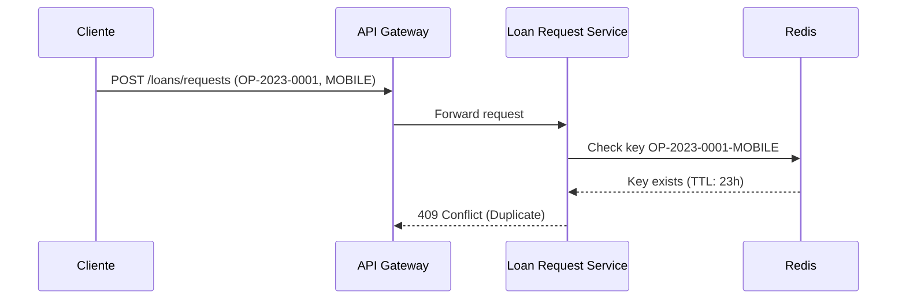

# Atributos de Calidad del Sistema de Préstamos

## 1. Throughput

### Escenario
El sistema debe procesar **10,000 solicitudes de préstamo por hora** durante picos de demanda (ej. inicio de mes), sin degradar el rendimiento de otros componentes.

### Métrica
- **Unidades**: Solicitudes procesadas por hora.
- **Herramienta**: Métricas de Prometheus (contador de solicitudes en Loan Request Service).
- **Umbral**: ≥ 10,000 solicitudes/hora.

### Implementación
- **Loan Request Service**: Escalado horizontal en EKS (mínimo 5 pods).
- **Base de Datos**: PostgreSQL con réplicas de lectura.
- **Kafka**: Particiones suficientes para manejar el volumen de eventos.

### Riesgos
- **Saturación del Buró de Crédito**: Si el Buró no soporta el throughput, el sistema fallará.
  - **Mitigación**: Implementar caché de respuestas del Buró con TTL de 5 minutos.

## 2. Latencia

### Escenario
El tiempo de respuesta percibido por el cliente (desde el envío de la solicitud hasta la confirmación) debe ser **≤ 3 segundos** en el percentil 95.

### Métrica
- **Unidades**: Tiempo de respuesta en milisegundos (p95).
- **Herramienta**: Métricas de New Relic (APM).
- **Umbral**: ≤ 3,000 ms.

### Componentes Críticos
| Componente               | Latencia Esperada | Latencia Máxima | Estrategia de Mitigación               |
|---------------------------|-------------------|-----------------|-----------------------------------------|
| API Gateway              | 50 ms             | 100 ms          | Rate limiting y caching de respuestas.  |
| Loan Request Service     | 500 ms            | 1,000 ms        | Optimización de queries a la BD.        |
| Credit Bureau            | 500 ms            | 2,000 ms        | Timeout de 2s y fallback a caché.       |
| Loan Approval Service    | 300 ms            | 800 ms          | Escalado horizontal.                    |
| Kafka                    | 100 ms            | 200 ms          | Particiones y replicación.              |

### Trade-offs
- **Latencia vs. Precisión**: Usar caché del Buró reduce latencia pero puede usar datos obsoletos.
  - **Decisión**: Aceptar datos con hasta 5 minutos de antigüedad para solicitudes repetidas.

## 3. Disponibilidad

### Escenario
El sistema debe estar disponible el **99.9% del tiempo mensual**, incluyendo mantenimiento programado.

### Métrica
- **Unidades**: Porcentaje de uptime.
- **Herramienta**: Pingdom (monitoreo externo).
- **Umbral**: ≥ 99.9% (≤ 43.2 minutos de downtime/mes).

### Estrategias
- **Redundancia**: Todos los componentes críticos tienen réplicas (EKS, PostgreSQL, Kafka).
- **Circuit Breaker**: Implementado en llamadas al Buró de Crédito (Resilience4j).
- **Fallback**: Si el Buró falla, usar score crediticio del último mes almacenado en caché.

## 4. Idempotencia

### Escenario
Evitar duplicados en solicitudes de préstamo cuando un cliente reintenta una operación dentro de **24 horas**.

### Métrica
- **Unidades**: Número de solicitudes duplicadas rechazadas.
- **Herramienta**: Logs de Loan Request Service.
- **Umbral**: 0 solicitudes duplicadas procesadas.

### Implementación
- **Mecanismo**: Caché distribuida (Redis) con clave `{operationNumber}-{channel}`.
- **TTL**: 24 horas.
- **Validación**: Rechazar solicitudes con la misma clave dentro del TTL.

### Ejemplo

## 5. Consistencia Eventual

### Escenario
El sistema de auditoría debe recibir **todos los eventos de préstamo** (aprobados/rechazados) dentro de **5 segundos** después de la decisión.

### Métrica
- **Unidades**: Tiempo de propagación de eventos.
- **Herramienta**: Métricas de Kafka (lag de consumidores).
- **Umbral**: ≤ 5,000 ms.

### Implementación
- **Kafka**: 3 réplicas por topic.
- **Audit Service**: Consumidores con commit manual después de procesar.

## Priorización de Atributos

| Atributo               | Prioridad | Justificación                                                                 |
|------------------------|-----------|-------------------------------------------------------------------------------|
| Disponibilidad         | Alta      | Requerimiento contractual (SLA 99.9%).                                       |
| Throughput             | Alta      | Capacidad para manejar picos de demanda.                                     |
| Latencia               | Media     | Impacto en experiencia de usuario, pero aceptable con mitigaciones.          |
| Idempotencia           | Media     | Requerimiento explícito del negocio para evitar duplicados.                  |
| Consistencia Eventual  | Baja      | Auditabilidad es importante, pero no crítico para el flujo principal.       |

---